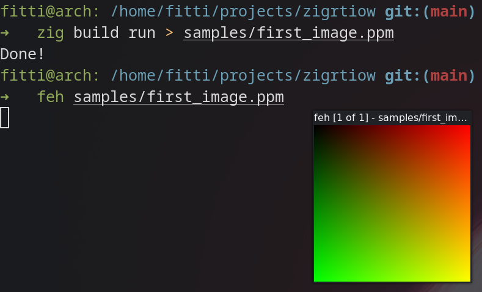
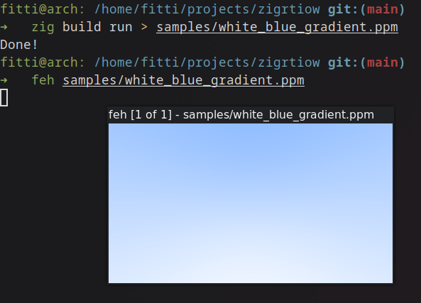

# [Ray Tracing in One Weekend](https://raytracing.github.io/)
But in Zig!

# Book 1
## 2. Output an Image
Translating the first bit of code from the book into Zig, we have created
our !  
Since GitHub doesn't display .ppm images, here's a png:  

## 4. Rays, a Simple Camera, and Background
After some more Stuff™ was written, there are now rays and colors and viewports and cameras!  
It's a lot more impressive behind the scenes than the  communicates.  
Again, here's a screenshot to show it to you:  

