# [Ray Tracing in One Weekend](https://raytracing.github.io/)
But in Zig!

# Book 1
## 2. Output an Image
Translating the first bit of code from the book into Zig, we have created
our first image!  

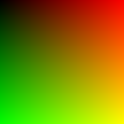  

## 4. Rays, a Simple Camera, and Background
After some more Stuff™ was written, there are now rays and colors and
viewports and cameras!  
It's a lot more impressive behind the scenes than the produced image
lets on!  

  

## 5. Adding a Sphere
I'm now able to add spheres to my scene! Following the book, I was able to
produce a simple image of a red sphere on my gradient.  

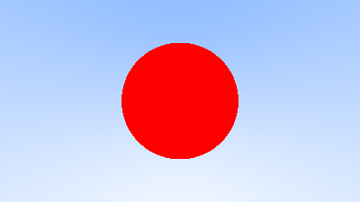  

### Bonus
Before moving on to the next chapter, I wanted to add some depth to the very
flat sphere, so I decided to darken it based on the distance to the camera.  

  

After that, I wanted to have some more color, so I tried turning the
collision normal into a color.  
First, I used the absolute value:  

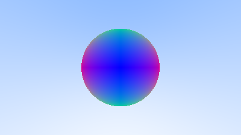  

Then I added (1, 1, 1) to the normal and divided it by 2:  

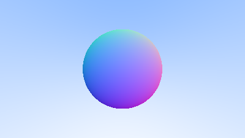  

I also tried just norming the vector again after shifting it, but I like
the previous one better than this:  

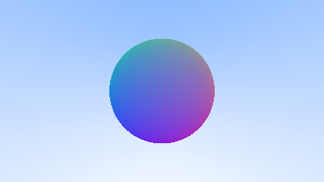  

### Bonus Bonus
Couldn't resist and wanted to see if I could add a naive light source. I could.  

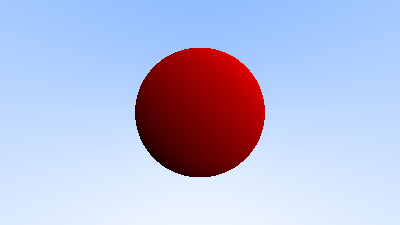  

## 6. Surface Normals and Multiple Objects
Turns out chapter 6 wanted me to do what I already did at the end of
chapter 5 on my own!  

Later, a list of renderable objects was introduced, allowing me to have
multiple objects in the image at the same time!  

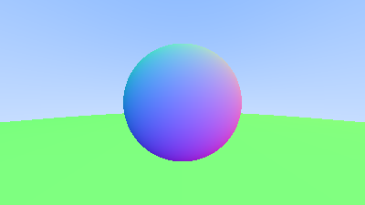  

Before I did that, I actually made two red spheres using my simple light
source.  

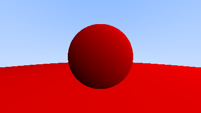  

## 8. Antialiasing
Chapter 7 was about doing some refactoring which didn't apply to my
implementation, as the camera was already in its own file, just under a
different name.  
In chapter 8, however, I added something cool: Antialiasing! Through
random sampling of a small square around each target pixel, and
subsequent averaging of the sampled values, a less jagged edge is
produced, which looks a lot nicer.  
Look at the direct comparison!  

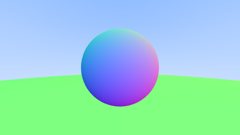  

## 9. Diffuse Materials
At the beginning of this chapter, a couple of randomization methods are
implemented, which are then used to enable diffuse materials.  
Here is a first example, using the two spheres from before.  

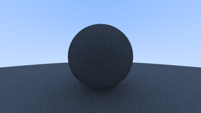  

It turns out the image is a lot darker than it should be, due to a
phenomenon called "shadow acne."  
The point at which a ray intersects a sphere is never return perfectly,
due to floating point errors. If the returned value is ever so slightly
below the sphere's surface, casting another ray from that point will lead
to another intersection immediately.  
This problem is solved by simply ignoring any collisions for some very
small values of `t`.  
Here is the result of that fix.  

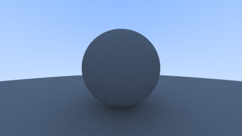  

After implementing this simple uniform reflection, it was replaced with
more realistic lambertian reflection instead, which resulted in this
image.  

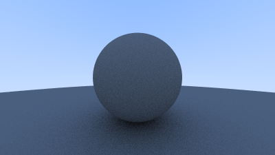  

Setting the reflectance to 10%, 30%, 50%, 70%, and finally 90% shows the
gamut of the renderer.  

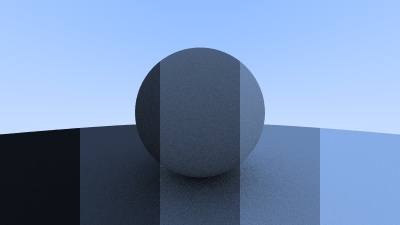  

Here is the gamut after applying gamma correction, showing the brightness
more correctly.  

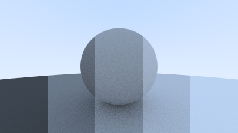  

## 10. Metal
After lots of refactoring, there are now different materials.  
In addition to the original lambertian diffuse reflector, there is now
also metal!  

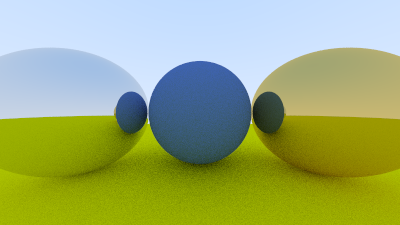  
